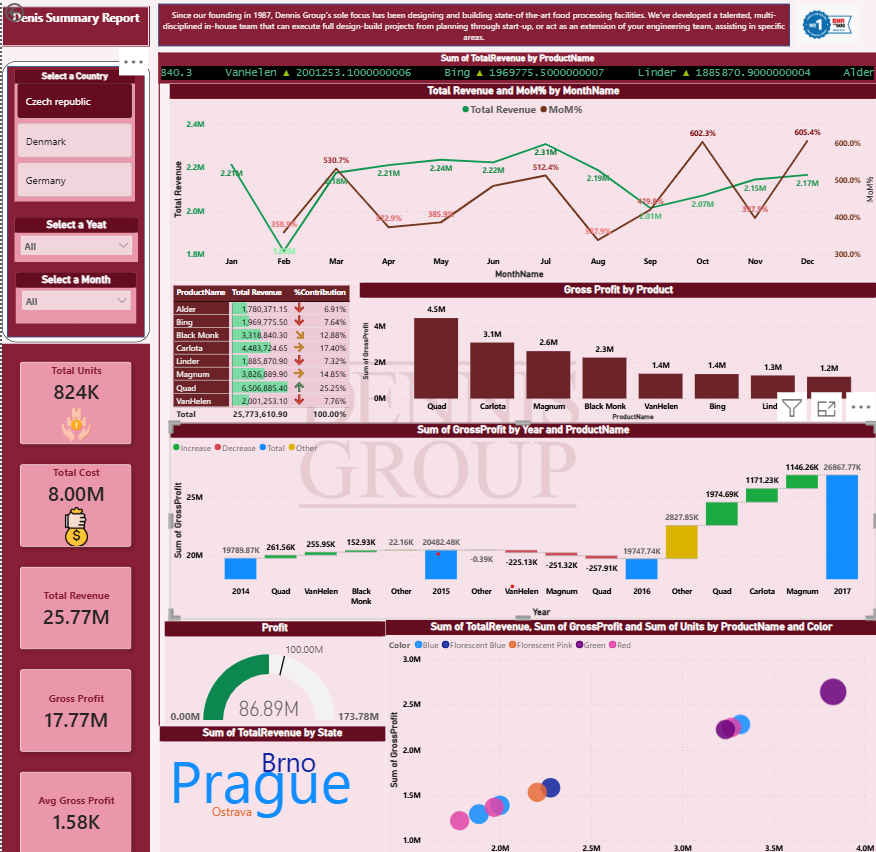
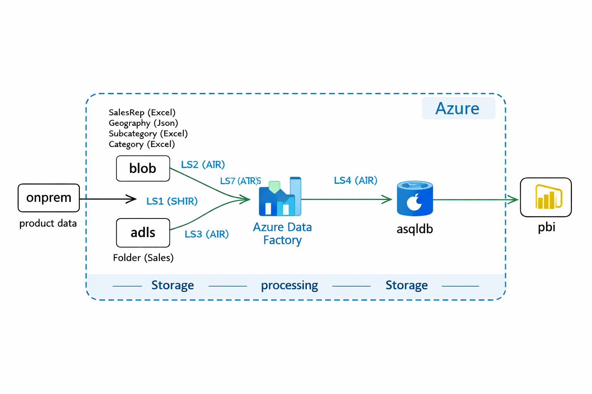
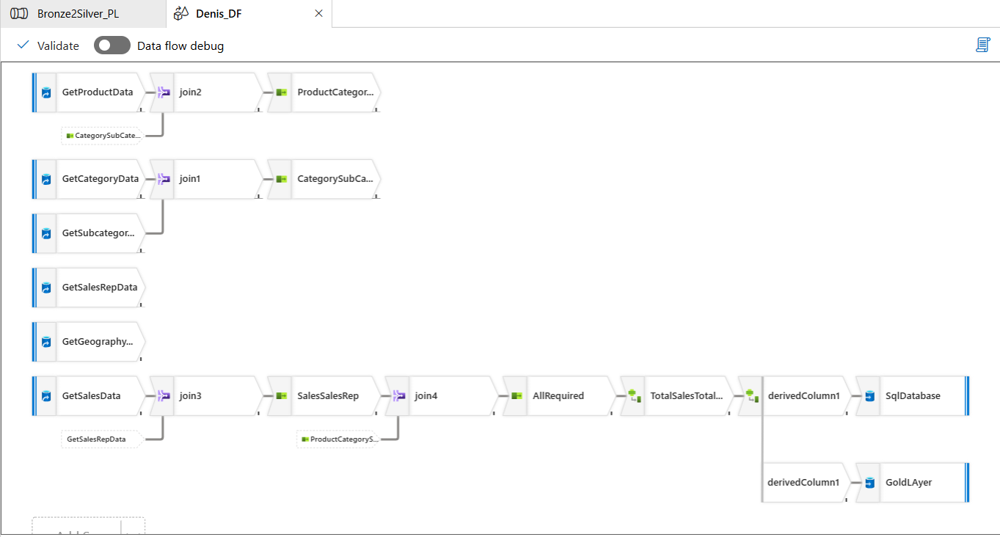

# Denis Summary Report – Power BI + Azure Data Factory

## Overview
This project showcases the Denis Summary Report built in Power BI, using data processed through an Azure Data Factory pipeline following the Medallion Architecture (Bronze → Silver → Gold). The dashboard provides insights into revenue, cost, profit, and product/state-level performance.

---

## Dashboard Preview

---

## PBIX File
`Dennis_Summary_Report.pbix` contains the complete Power BI dashboard with:
- Revenue, cost, and profit KPIs  
- Product-wise and state-wise performance  
- Monthly trends and gross profit analysis  
- Clean layout designed for management insights  

---

## Architecture

 

## Azure Data Factory Pipeline (Bronze → Silver → Gold)
The Azure Data Factory pipeline orchestrates data ingestion, transformation, and loading across the Medallion layers:

- **Bronze Layer:** Raw ingestion from Product, Category, Subcategory, Sales, SalesRep, and Geography tables.  
- **Silver Layer:** Joins and transformations to create a clean, analytics-ready dataset.  
- **Gold Layer:** Aggregated and enriched data loaded into SQL Database and Gold storage for Power BI reporting.

### Pipeline Design

## Deployment and Publishing

- Published the Power BI report to **Power BI Service** workspace.
- Configured **scheduled refresh** (8 times/day for Pro, 48 for Premium).
- Connected dataset to **Azure SQL Gold Layer** via On-premises Data Gateway.
- Shared dashboard with RLS-enabled roles for secure access.

---

## Repository Structure
- `Dennis_Summary_Report.pbix`  
- `/screenshots` – Power BI dashboard images  
- `/ADF-Pipeline-Design` – ADF pipeline screenshot and (optionally) pipeline documentation  

---

## Tech Stack
Power BI | Azure Data Factory | SQL Server | DAX | Power Query

## Note
The original ADF pipeline was created in a trial Azure account that has since expired. This repository includes the Power BI report and the pipeline design for portfolio demonstration.
