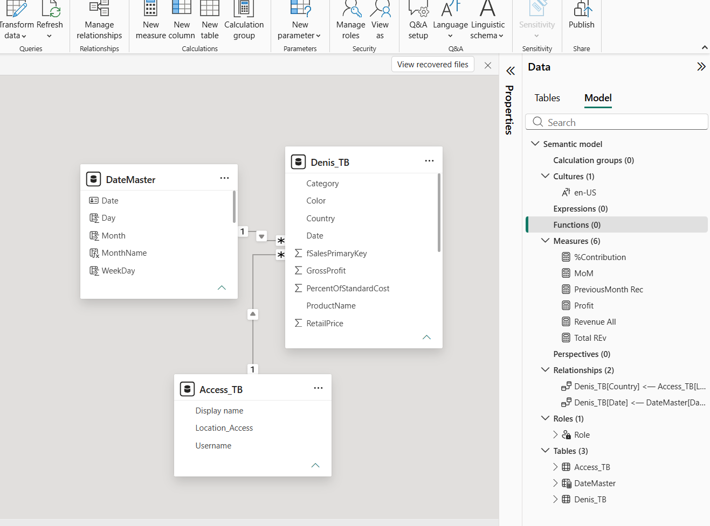

# Data Model – Denis Summary Report

## Overview
The data model for the Denis Summary Report is designed using a star-schema layout.  
It includes one fact table and two dimension tables, optimized for time intelligence and regional analysis.  
This structure supports KPI cards, trend visuals, and DAX-based calculations in Power BI.

---

## Tables

### **1. Denis_TB (Fact Table)**
Contains transactional data such as:
- Revenue
- Cost
- Profit
- Country
- Date
- Product details

This is the central table used for all KPI and trend calculations.

### **2. DateMaster (Date Dimension)**
A calendar table used for:
- Month-over-month (MoM) comparisons
- Previous month calculations
- Time-based filtering and grouping

### **3. Access_TB (Region Dimension)**
Contains location and access details:
- Country / Region mapping
- Used to categorize sales by geography

---

## Relationships

| Relationship | Type | Purpose |
|---------------|------|----------|
| `Denis_TB[Date] → DateMaster[Date]` | One-to-many | Enables time-based analysis and DAX time intelligence |
| `Denis_TB[Country] → Access_TB[Location]` | One-to-many | Links sales data to regional access information |

These relationships form a clean star schema with `Denis_TB` at the center.

---

## Measures Summary
The model includes six DAX measures used in the dashboard:

- **%Contribution** – Shows each category or region’s contribution to total revenue  
- **MoM** – Month-over-month growth  
- **PreviousMonth Rec** – Revenue from the previous month  
- **Profit** – Revenue minus cost  
- **Revenue All** – Total revenue across all filters  
- **Total REv** – Main revenue measure used in KPI cards  

Full DAX formulas are documented in `dax_measures.md`.

---

## Data Model Diagram
Below is the visual representation of the model showing tables, relationships, and measures:

---

## Notes
- The model uses a semantic layer with culture `en-US`.  
- Relationships are single-direction to maintain performance and avoid ambiguity.  
- Measures are optimized for Power BI visuals and time intelligence.

